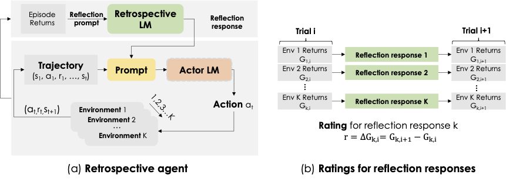

<p align="center">
    
  </a>
</p>

<p align="center">
    <a href="https://github.com/huggingface/trl/blob/main/LICENSE">
        
    </a>
    <a href="https://huggingface.co/docs/trl/index">
        
    </a>
</p>
      
<p align="center">
  <a href="https://retroformer.github.io/"><strong>[🏠Website & Demo]</strong></a> 
  |<a href="https://openreview.net/pdf?id=KOZu91CzbK"><strong>[📄ICLR Spotlight]</strong></a> |
<a href="https://huggingface.co/papers/2308.02151"><strong>[🤗HF Paper]</strong></a> |
<a href="https://huggingface.co/datasets/Salesforce/RLHF-Retroformer"><strong>[📊Datasets]</strong></a> |
<a href="https://huggingface.co/Salesforce/Retroformer"><strong>[🤖Models]</strong></a> |
<a href="mailto:weiran.yao@salesforce.com"><strong>[📧 Contact Us]</strong></a>
</p>

## 👋 Overview <a name="overview"></a>
This paper introduces a principled framework for reinforcing large language agents by learning a retrospective model, which automatically tunes the language agent prompts from environment feedback through policy gradient. Specifically, our proposed agent architecture learns from rewards across multiple environments and tasks, for fine-tuning a pre-trained language model which refines the language agent prompt by summarizing the root cause of prior failed attempts and proposing action plans. Experimental results on various tasks demonstrate that the language agents improve over time and that our approach considerably outperforms baselines that do not properly leverage gradients from the environment.

<p align="center">
  
</p>

### ✨ Framework <a name="aci"></a>
Retroformer is comprised of two language model components: an **actor** LLM, denoted, which generates reasoning thoughts and actions, and a **retrospective** LLM, which generates verbal reinforcement cues to assist the actor in self-improvement by refining the actor prompt with reflection responses. 

The actor model is regarded as an frozen LLM, such as GPT, with inaccessible model parameters. In this scenario, the most direct approach to enhancing actor performance in a given environment is by refining the actor LM's prompt. Consequently, the retrospective model, a smaller local language model, refines the actor's prompt by incorporating a concise summary of errors and valuable insights from failed attempts. We therefore aim to optimize the retrospective model using environment reward. The desired behavior of $M_r$ is to improve the actor model $M_a$ in next attempt. Hence, the difference in episode returns between two consecutive trials naturally serves as a reward signal for fine-tuning the retrospective model with reinforcement learning. 

Read our paper for more details.

```
@article{yao2023retroformer,
  title={Retroformer: Retrospective large language agents with policy gradient optimization},
  author={Yao, Weiran and Heinecke, Shelby and Niebles, Juan Carlos and Liu, Zhiwei and Feng, Yihao and Xue, Le and Murthy, Rithesh and Chen, Zeyuan and Zhang, Jianguo and Arpit, Devansh and others},
  journal={arXiv preprint arXiv:2308.02151},
  year={2023}
}
```

## 🚀 Setup <a name="setup"></a>
1. [Install Miniconda](https://docs.anaconda.com/free/miniconda/miniconda-install/)
2. Configure the training environment
```bash
conda create -n train python=3.10 -y
pip install -r requirements.txt
```
3. Configure the local LLM environment. Go to llm/serve.sh and run the command one by one

4. Configure the evaluation environment. Install THREE separate Python environments for evaluation tasks.
- HotPotQA
```
conda create -n hotpotqa python=3.10 -y
pip install -r experiments/hotpotqa_runs/requiresments.txt
```
- Webshop. Install the requirements for the webshop on: https://github.com/princeton-nlp/WebShop
- Alfworld. Install the requirements for the Alfworld on https://github.com/alfworld/alfworld
5. Configure the environment variables in the `.env` file.
```
OPENAI_API_KEY='OpenAI API Key Here if using OpenAI Model (required for inference)'
OPENAI_MODEL='OpenAI MODEL NAME'
CKPT_DIR=/path/to/checkpoints
DATA_DIR=/path/to/data
```

### 👩‍💻 Experiments <a name="inference"></a>
* Model training. Run these three scripts one by one.

```bash
python sft_run.py
python reward_run.py
python ppo_run.py
```
* Evaluation
Note that the evaluation environment are largely imported from the original [Reflexion code repo](https://github.com/noahshinn/reflexion). We thank the Reflexion team for providing the evaluation environments and self-reflection agent architecture. 
* See the [`experiments/hotpotqa`](experiments/hotpotqa) folder for running hotpotqa experiments.
* See the [`experiments/alfworld`](experiments/alfworld) folder for running alfworld experiments.
* See the [`experiments/webshop`](experiments/webshop) folder for running webshop experiments.
* See the [`data/`](trajectories) folder for details about the preference data and generation methods. We provide data samples for hotpotqa environment in this repo.

## 🪪 License <a name="license"></a>
APACHE 2.0. Check `LICENSE`.
